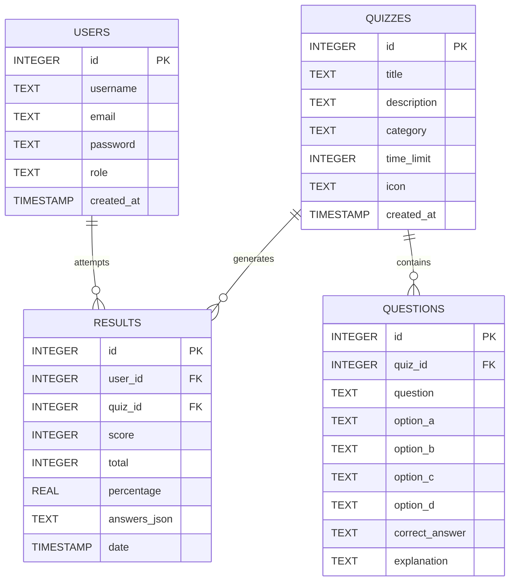

# QuizMaster – Online Quiz Management System
> **Open Source Tools and Frameworks with Python Project**

[](https://online-quiz-application-t1xn.onrender.com)
[](https://www.python.org/)
[](https://flask.palletsprojects.com/)

---

## 🌐 Live Application Link

| Application | Live URL | Direct Login URL | Demo Credentials |
| :--- | :--- | :--- | :--- |
| 🎓 **QuizMaster Portal** | [**https://online-quiz-application-t1xn.onrender.com**](https://online-quiz-application-t1xn.onrender.com) | [`/login`](https://online-quiz-application-t1xn.onrender.com/login) | `rahul@gmail.com` / `rahul123` |

> 💡 **Note**: Hosted live on Render. Free instances may take ~30-50 seconds to spin up on initial access after periods of inactivity.

---

An end-to-end, responsive web-based quiz management and testing platform built with **Python 3**, **Flask**, **SQLite3**, **Jinja2**, and **Bootstrap 5**.

---

## 🌟 Key Features

### 🎓 Student / User Features
* **Authentication**: Secure user registration & login with cryptographic password hashing (`werkzeug.security`).
* **Interactive Quiz Taking**:
  * Live countdown timer with auto-submit on expiration.
  * Real-time progress bar tracking answered vs. unanswered questions.
  * Clean, accessible multiple-choice interface (A, B, C, D cards).
* **Automatic Evaluation Engine**:
  * Instant score and percentage calculation upon submission.
  * Performance rating badges (*Outstanding*, *Good Job*, *Keep Practicing*, etc.).
  * Animated circular SVG score progress gauge.
* **Detailed Question Review**:
  * Step-by-step breakdown showing student answers, correct answers, and rich explanations.
* **Personal Dashboard & History**:
  * Overview statistics: Quizzes completed, average percentage, best score.
  * Historical records table with instant "Review Result" access.
* **Global Hall of Fame / Leaderboard**:
  * Live ranking of top scorers across the entire platform.

### 🛡️ Administrator Features
* **Admin Dashboard Overview**: Key metrics (Total Users, Active Quizzes, Questions, Submissions, Average Platform Score).
* **Quiz Management (CRUD)**: Create, edit, and delete quizzes with customizable time limits, categories, and icons.
* **Question Management (CRUD)**: Add, modify, or remove questions with 4 options, answer key, and solution explanations.
* **User Management**: View student accounts, view participation stats, toggle admin roles, and manage accounts.
* **Platform Submission Analytics**: Filter and search all student quiz attempts by student name/email or specific quiz category.

---

## 🛠️ Open-Source Technologies & Frameworks Used

| Open-Source Tool | Category | Role in this Project |
| :--- | :--- | :--- |
| **Python 3** | Programming Language | Core backend business logic, score calculations, data structures. |
| **Flask** | Web Microframework | URL routing, request/response cycle, sessions, flash messaging, middleware. |
| **SQLite3** | Embedded Relational Database | Zero-configuration database storing users, quizzes, questions, and results. |
| **Werkzeug** | WSGI Utility Library | Cryptographic password hashing (`generate_password_hash`, `check_password_hash`). |
| **Jinja2** | Template Engine | Dynamic HTML rendering with inheritance, conditionals, and template filters. |
| **Bootstrap 5 & Icons** | Frontend CSS/JS Framework | Responsive mobile-first layout, custom glassmorphism design system. |

---

## 📁 Project Directory Structure

```text
QuizMaster/
│
├── app.py                     # Main Flask app, middleware, context & blueprint registration
├── auth_routes.py             # Public & Auth routes (Landing, Login, Register, Logout)
├── student_routes.py          # Student-specific routes (Dashboard, Take Quiz, Submit, Results)
├── admin_routes.py            # Administrator-specific routes (Admin Console, Quizzes CRUD, Questions CRUD, Users, Results)
├── decorators.py              # Role-based access control decorators (@login_required, @admin_required)
├── database.py                # Database initialization, schemas & seed data
├── database.db                # SQLite database file (auto-generated)
├── requirements.txt           # Python package dependencies
├── test_app.py                # Comprehensive test suite covering authentication, quiz flow & dashboard separation
├── README.md                  # Comprehensive project report & viva guide
│
├── templates/                 # Jinja2 HTML Templates
│   ├── base.html              # Shared base layout
│   ├── index.html             # Landing page with stats & available quizzes
│   ├── login.html             # Login card with quick demo credential fillers
│   ├── register.html          # User registration form
│   ├── 404.html               # Custom 404 Error Page
│   ├── 500.html               # Custom 500 Error Page
│   │
│   ├── student/               # 🎓 Dedicated Student Templates (Completely Isolated)
│   │   ├── base.html          # Student Portal layout (Student-only navigation)
│   │   ├── dashboard.html     # Student Dashboard (My stats, available quizzes, my attempts)
│   │   ├── quiz.html          # Interactive quiz runner with live countdown timer
│   │   ├── result.html        # Score breakdown & question explanation review
│   │   └── leaderboard.html   # Student Hall of Fame ranking
│   │
│   └── admin/                 # 🛡️ Dedicated Administrator Templates (Completely Isolated)
│       ├── base.html          # Admin Console layout (Dark indigo topbar & admin tools)
│       ├── dashboard.html     # Admin Management Console (Platform stats, Quizzes CRUD, Questions)
│       ├── quiz_form.html     # Add / Edit Quiz modal form
│       ├── question_form.html # Add / Edit Question modal form
│       ├── users.html         # User management & role promotion
│       └── results.html       # Full searchable submission logs
│
└── static/                    # Static Assets
    ├── css/
    │   ├── style.css          # Core modern theme & glassmorphism system
    │   ├── student.css        # Dedicated Student Portal styling
    │   └── admin.css          # Dedicated Administrator Console styling
    └── js/
        └── script.js          # Countdown timer, progress bar & UI interactions
```

---

## 🚀 How to Run the Applications

### 1. Install Dependencies
```bash
pip install -r requirements.txt
```

### 2. Run Both Applications Simultaneously
```bash
python app.py
```
*(Or run `python run_all.py`)*

---

## 🌐 Separate Application Access Links

The Student and Administrator applications run as **two completely separate web applications** on distinct ports:

### 🎓 1. Student Portal (Port 5000)
- **URL**: 👉 **`http://127.0.0.1:5000`**
- **Student Login**: 👉 **`http://127.0.0.1:5000/login`**
- **Student Registration**: 👉 **`http://127.0.0.1:5000/register`**
- **Demo Student Credentials**:
  - **Email**: `rahul@gmail.com`
  - **Password**: `rahul123`
- *Features*: Browse quizzes, live interactive timer test runner, automatic score gauge, question-by-question explanation review, student dashboard, hall of fame.

---

### 🛡️ 2. Administrator Control Center (Port 5001)
- **URL**: 👉 **`http://127.0.0.1:5001`**
- **Admin Login**: 👉 **`http://127.0.0.1:5001/login`**
- **Demo Admin Credentials**:
  - **Email**: `admin@quizmaster.com`
  - **Password**: `admin123`
- *Features*: System overview & metrics (users, quizzes, questions, submissions, avg score), Quiz CRUD, Question CRUD, User management & role promotion, searchable submission logs. Non-admin accounts are blocked.

---

### 🔧 Running Applications Individually

You can also run either application standalone in its own terminal:
```bash
# Run Student Portal only (Port 5000)
python student_app.py

# Run Admin Control Center only (Port 5001)
python admin_app.py
```

---

## 🗄️ Database Architecture (SQLite)



---

## 🎓 College Viva & Presentation Q&A

### Q1: Why is Flask called a "Microframework"?
**Answer:** Flask is called a microframework because it does not require particular tools or libraries. It keeps the core simple and extensible, leaving database choices (like SQLite), form handling, and authentication open to developer customization rather than enforcing a rigid monolithic structure like Django.

### Q2: How does password security work in this project?
**Answer:** Passwords are never stored in plain text. We utilize Werkzeug's `generate_password_hash()` which generates a cryptographically salted hash (PBKDF2 with SHA256). During login, `check_password_hash()` verifies the entered password against the stored hash securely without ever revealing the original string.

### Q3: How is user session maintained across requests?
**Answer:** Flask's `session` object uses cryptographically signed cookies via `app.secret_key`. When a user logs in, their `user_id` is stored in the signed session, and a `@login_required` decorator checks the session on protected endpoints.

### Q4: How is the database initialized?
**Answer:** `database.py` contains `init_db()` which uses SQLite `CREATE TABLE IF NOT EXISTS` queries and seeds initial quizzes (Python Basics, Flask Basics, Open Source Fundamentals) along with default admin and student accounts if the database is newly created.
>>>>>>> 5e135ce (Update live demo links in README to Render URL)
